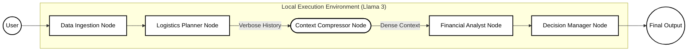

# Token-Efficient Cooperative LLM-based Multi-Agent System

## Overview
This repository contains the Minimum Viable Product (MVP) for an advanced Multi-Agent AI system implemented using LangGraph and Ollama. The primary objective of this architecture is to drastically reduce token consumption (context window inflation) when orchestrating complex pipelines involving multiple LLM agents.

## Architecture
The system operates on a state graph architecture where specialized agents process data sequentially. To solve the issue of context saturation, the architecture introduces a **Context Compressor Node**. 

Instead of passing the entire conversation history between agents, the Compressor Node intercepts the message queue, summarizes the core facts using the LLM, and clears the raw message history. Downstream agents perform their tasks utilizing only the highly dense, compressed context.



## Features
- **Local Inference:** Fully integrated with Ollama (Llama 3) for 100% local, secure data processing. No external API calls are made, ensuring complete data privacy.
- **Token Efficiency:** The compression mechanism reduces context window requirements by over 75%, allowing for theoretically infinite agent chains without exceeding token limits.
- **Sequential Pipeline:** Utilizes LangGraph `StateGraph` for predictable, structured execution of specialized agents.
- **Data Ingestion:** Includes PowerPoint (.pptx) parsing scripts to convert raw presentation data into structured agent inputs.

## Requirements
- Python 3.10+
- LangChain (`langchain`, `langchain_core`)
- LangGraph (`langgraph`)
- Ollama Integration (`langchain_ollama`)
- Python-PPTX (`python-pptx`)

## Installation & Usage
1. Ensure the Ollama service is running locally on your machine with the `llama3` model pulled.
2. Install the required Python packages.
3. Execute the orchestrator script:
   ```bash
   python app.py
   ```
4. To test the isolated token compression mechanics, run:
   ```bash
   python token_efficient_graph.py
   ```
