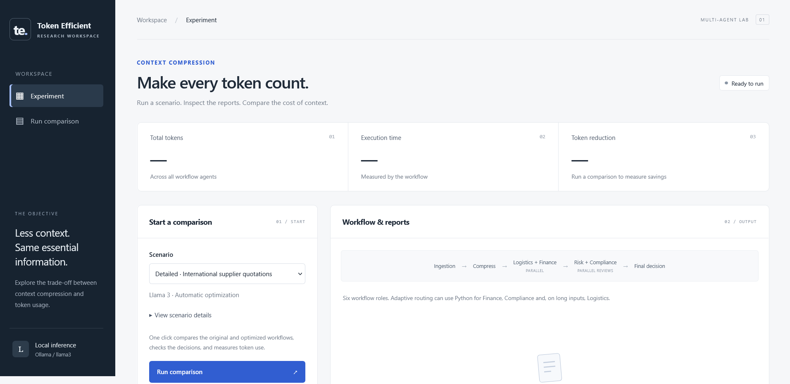
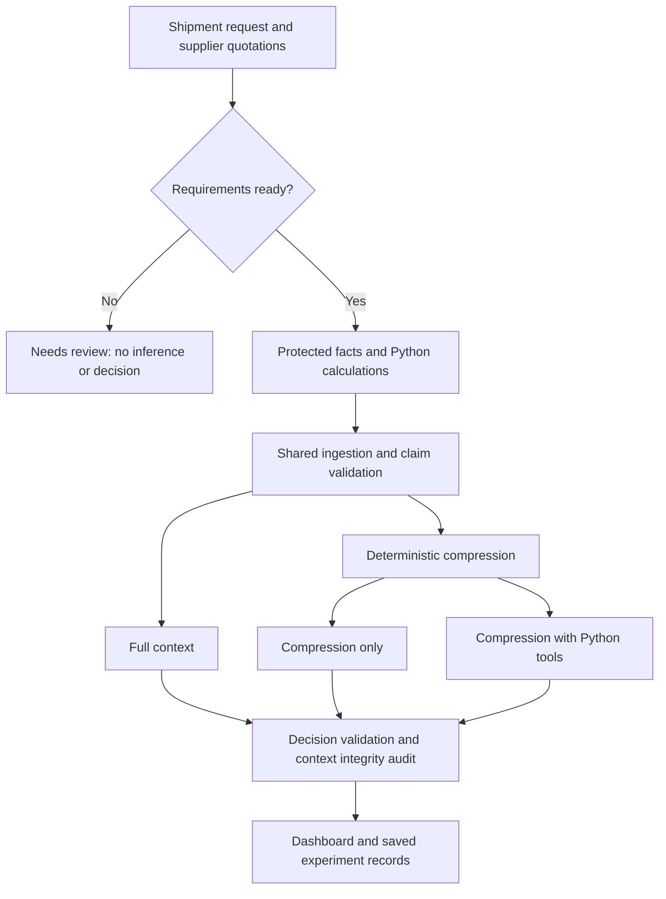
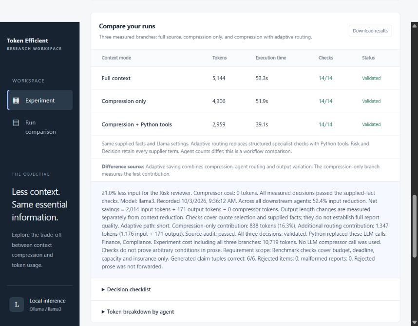
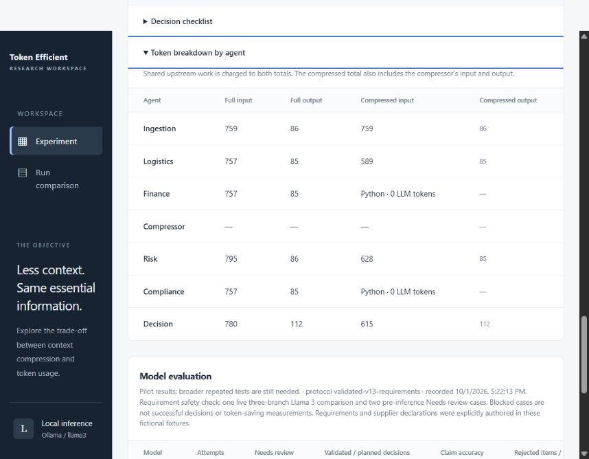

# Token Efficient

**Context compression and validated cooperation between local LLM agents.**

Token Efficient is a research platform for reducing the token cost of a multi-agent workflow while preserving the information needed to make a verifiable decision. It combines a deterministic context compressor, Python constraint checks, and LangGraph orchestration, with Llama 3 running locally through Ollama.

The application compares three workflows on the same shipment request and supplier quotations: full context, compression alone, and compression with Python tools. Its dashboard exposes the decision, agent reports, validation checks, and measured token use.



## The research question

Multi-agent systems can resend the same facts and intermediate reports at every step. This repetition increases token consumption. Summarizing the context can reduce that cost, but it can also omit a constraint, alter a number, or pass an unsupported claim to the next agent.

This project investigates a practical question:

> How much can a cooperative LLM workflow reduce its token use while preserving its source information and checking its decisions against explicit rules?

The case study is selecting the lowest-cost eligible shipping quotation. Fictional scenarios make the expected result independently calculable from prices, arrival dates, capacity, insurance, and declared supplier capabilities.

## What the system does

- **Preserves the source.** A protected facts record retains the complete request, quotation fields, original supplier terms, and declared requirements.
- **Compresses deterministically.** Python renders a compact representation with a concise constraint audit. The default compressor consumes no LLM inference tokens.
- **Routes suitable work to Python.** Arithmetic and explicit constraint checks replace selected specialist LLM calls.
- **Validates before forwarding.** Structured claims and their explanations are checked before downstream agents receive them. Rejected outputs remain in the experiment record.
- **Checks the final decision.** Invalid selections or explanations fail validation. Missing or unsupported requirements stop the run for review.
- **Measures the complete comparison.** Saved records include prompts, outputs, input and output tokens, execution times, protocol settings, and source-integrity checks.

The current default dashboard protocol is **`validated-v13-requirements`**, presented as **Automatic** in the interface.

## Architecture


```mermaid
flowchart TD
    S[Shipment request and supplier quotations] --> R{Requirements ready?}
    R -->|No| N[Needs review: no inference or decision]
    R -->|Yes| P[Protected facts and Python calculations]
    P --> I[Shared ingestion and claim validation]
    I --> B[Full context]
    I --> C[Deterministic compression]
    C --> O[Compression only]
    C --> A[Compression with Python tools]
    B --> V[Decision validation and context integrity audit]
    O --> V
    A --> V
    V --> D[Dashboard and saved experiment records]
```

LangGraph manages the workflow state and dependencies. The state retains the original source and raw outputs for auditing; only validated reports are eligible for forwarding.

### Agent roles and execution

| Role | Responsibility | Full context / compression only | Adaptive short path | Adaptive long path |
| --- | --- | --- | --- | --- |
| Ingestion | Produce structured source claims | LLM | LLM | LLM |
| Logistics | Review deadline and capacity | LLM | LLM | Python |
| Finance | Check the budget | LLM | Python | Python |
| Risk | Review claims and source caveats | LLM | LLM | LLM |
| Compliance | Check insurance and declared capabilities | LLM | Python | Python |
| Decision | Return the final selection and explanation | LLM | LLM | LLM |

The short route currently requires at most two quotations and a source of at most 2,600 characters. Other inputs use the long route. This is an explicit routing heuristic, not a prediction of a minimum saving.

The two reference branches use six LLM roles. The adaptive branch uses four on the short path and three on the long path, including Ingestion. Ingestion runs once and is shared across the comparison. Every active LLM role retains the complete request, structured quotation facts, supplier terms, and declared requirements.

## Measured results

The following are saved **v13 Llama 3 experiments**, not simulated test results or guaranteed performance targets.

| Scenario | Full context | Compression only | Compression + Python | Total reduction | Final checks per branch |
| --- | ---: | ---: | ---: | ---: | --- |
| Two courier quotations | 5,144 tokens | 4,306 tokens | 2,959 tokens | 42.48% | 14/14 |
| Six quotations with required refrigeration | 12,016 tokens | 10,180 tokens | 5,232 tokens | 56.46% | 16/16 |



All three decisions passed their checks in each completed comparison. Two additional requirement-review cases stopped before inference; they are recorded separately and are not counted as successful decisions or token-saving measurements.

Sources: [short comparison](verification/paired-f8fee089-1eb7-4622-962c-2891b0a1a2b7.json), [requirement-review experiments](verification/requirements-v13-20261001.json), and [v13 evaluation summary](verification/requirements-v13-20261001.summary.json).

### Where the savings come from



```text
Total reduction (%) = 100 * (full-context tokens - adaptive tokens) / full-context tokens
```

For the short example, the 2,185-token difference consists of:

- **838 tokens** between full context and compression alone: a 16.29% reduction against the baseline.
- **1,347 additional tokens** between compression alone and the adaptive workflow.

The additional difference includes avoided specialist calls and changes in output length. It is not attributed entirely to the compressor. The records report input savings, output variation, and compressor cost separately.

Each branch total includes the shared Ingestion cost. The physical cost of running all three branches counts Ingestion once: **10,719 tokens** for this short comparison. Comparing workflows therefore costs more than deploying the optimized branch alone.

A separate [historical v12 campaign](verification/adaptive-v12-20261001.summary.json) contains six runs with alternating branch order: mean total reduction **52.36%**, sample standard deviation **7.20 percentage points**, and **18/18 validated decisions**. These observations belong to v12 and do not establish the additional requirement-review guarantees introduced in v13.

## Run locally

### Requirements

- Python **3.10 or newer**; the local project environment uses Python 3.14.7.
- Git, or a downloaded copy of this repository.
- [Ollama](https://ollama.com/) running locally, with the `llama3` model available.

The dashboard uses plain HTML, CSS, and JavaScript. No Node.js build step is required. Model inference uses your local Ollama installation; no paid model API key is required.

### 1. Get the project and model

```bash
git clone https://github.com/abdelkaderelassali/Token-Efficient-Multi-Agent.git
cd Token-Efficient-Multi-Agent
ollama pull llama3
python -m venv .venv
```

Start the Ollama application or service before running a comparison.

### 2. Activate the environment and install dependencies

Windows PowerShell:

```powershell
.\.venv\Scripts\Activate.ps1
python -m pip install -r requirements.txt
```

macOS or Linux:

```bash
source .venv/bin/activate
python -m pip install -r requirements.txt
```

If PowerShell blocks activation, invoke `.\.venv\Scripts\python.exe -m pip install -r requirements.txt` directly and use `.\.venv\Scripts\python.exe` in place of `python` below.

### 3. Start the dashboard

```bash
python -m uvicorn api:app --host 127.0.0.1 --port 8000
```

Open **[http://localhost:8000](http://localhost:8000)**. The API documentation is available at **[http://localhost:8000/docs](http://localhost:8000/docs)**.

### 4. Run a comparison

1. Select a short, medium, or detailed example.
2. Keep the default **Automatic** setting and select **Run comparison**.
3. Read the final decision and the three measured branch totals.
4. Expand **Decision checklist** and **Token breakdown by agent** to inspect the result.
5. Use **Download results** to export the complete experiment record.

To inspect an existing run, open **Advanced settings** and choose **Load last saved comparison**. A new comparison may take several minutes depending on local hardware and model loading.

## Custom scenarios

Choose **Create your own scenario** to enter between one and twelve supplier quotations, or load an editable example. The form collects the complete request, shipping constraints, supplier terms, and explicit requirement confirmations.

Supported additional capabilities are refrigerated transport, fragile-item handling, and signature on delivery. Supplier answers distinguish **true**, **false**, and **unknown**. Missing answers, unconfirmed requirements, or other unsupported conditions produce **Needs review** before inference.

The user must check that the structured fields include every critical requirement. The application does not automatically certify the meaning or completeness of arbitrary free text.

## Tests and evaluation

Run the regression suite without model inference:

```bash
python -B -m unittest discover -s tests -v
```

The suite passed **147 tests on 3 October 2026**. Model responses are replaced with test doubles. These checks cover source preservation, structured claims, contradictory outputs, final decisions, token accounting, requirement review, and API behavior; they are not 147 independent live-model experiments.

Run two live comparisons with alternating branch order:

```bash
python evaluate_adaptive.py --case demo_short --repeats 2 --output verification/local/short-evaluation.json
python context_integrity_audit.py verification/local/short-evaluation.json --output verification/local/short-audit.json
```

Exercise the supported-requirement and review-required cases:

```bash
python verify_requirements.py --output verification/local/requirements-evaluation.json
```

These evaluation commands use the local model. Choose new output filenames for each campaign; the evaluation scripts refuse to overwrite existing result files. `verification/local/` is excluded from Git so exploratory runs do not become published evidence accidentally. Curated measurements remain in `verification/`.

## API

| Endpoint | Purpose |
| --- | --- |
| `GET /api/scenarios` | List available scenario data |
| `POST /api/compare` | Run and save a comparison |
| `GET /api/compare/template/{scenario_id}` | Retrieve an editable example |
| `GET /api/compare/latest/{scenario_id}` | Retrieve a saved comparison |
| `GET /api/evaluation/latest` | Retrieve a saved evaluation summary |

For the current adaptive workflow, send this body to `POST /api/compare`:

```json
{
  "scenario_id": "demo_short",
  "compression_mode": "auto",
  "fidelity": "adaptive"
}
```

Use `?fidelity=adaptive` when retrieving its comparisons or evaluation summaries. The API defaults to the complete-source reference protocol if `fidelity` is omitted, while the dashboard explicitly selects Adaptive.

## Repository guide

| Area | Main files |
| --- | --- |
| Dashboard and API | `api.py`, `index.html`, `script.js`, `style.css` |
| Custom input and requirement review | `custom_scenarios.py`, `custom_scenario.js`, `requirement_review.py` |
| Protected source and calculations | `protected_facts.py`, `quote_calculations.py` |
| Compression and adaptive routing | `lossless_projection.py`, `tool_routing.py`, `adaptive_workflow.py` |
| Workflow orchestration | `langgraph_orchestration.py`, `graph_verified_lossless_workflow.py` |
| Structured outputs and validation | `structured_claims.py`, `claim_guard.py`, `validation.py` |
| Evaluation and auditing | `evaluate_adaptive.py`, `verify_requirements.py`, `context_integrity_audit.py` |
| Fixtures, tests, and measured evidence | `demo_scenarios.json`, `tests/`, `verification/` |

Earlier workflows remain in the repository for regression tests and reproducibility. The current dashboard also exposes complete-source and decision-focused reference modes in its advanced settings. Results from different protocols should be compared only with their settings and validation scope identified.

## Scope and limitations

- The current case study uses fictional, structured shipping quotations. It is a research demonstrator, not a production shipping service.
- Python validates declared facts and supported rules. It cannot establish that a supplier's statement is true or that a user has declared every relevant condition.
- The final agent receives Python's calculated recommendation. Decision checks therefore evaluate faithful use of supplied facts and calculations, rather than unaided LLM reasoning.
- Source preservation and factual-claim checks do not certify the quality of all generated prose.
- The saved results cover a small local sample. No minimum token reduction or execution-time improvement is guaranteed for every scenario.
- Current results use Llama 3. Historical Phi-3 and Qwen experiments do not provide a fair ranking under the present protocol.


## Academic context

Developed by **Abdelkader Elassali** at **EMSI Recherche & Innovation**, supervised by **M. Hicham Bouchtib**, as a Projet de Fin d'Année (PFA).

**Research topic:** Token-Efficient Cooperative LLM-based Multi-Agent Systems.
